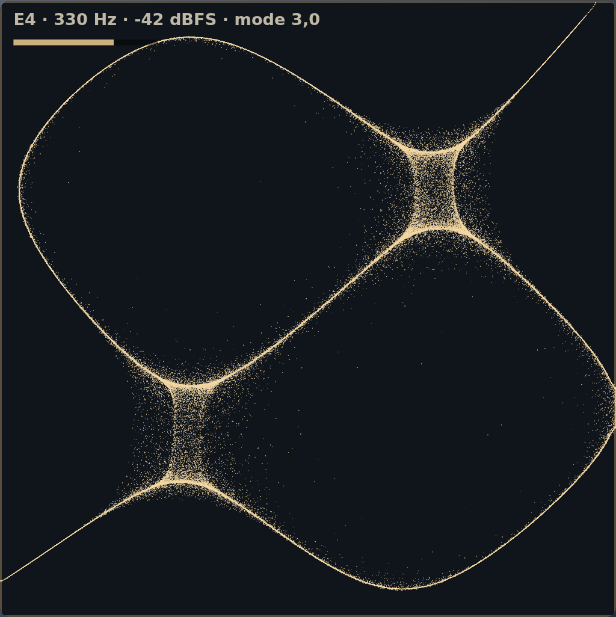
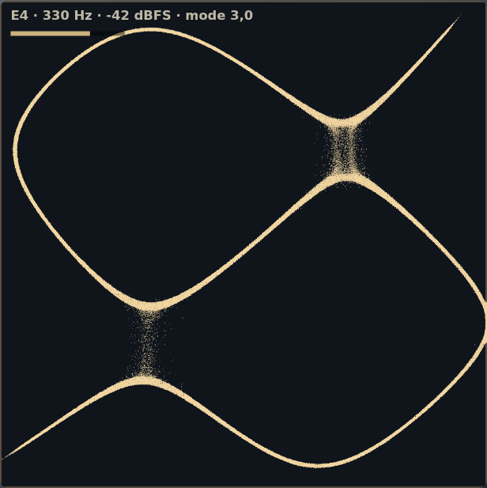

# Sand transport regression

The first commit (`79a521e`) used analytical cosine-product Chladni fields selected by frequency-band scores. `d371d08` fused FFT, DCT, RFT and constant-Q scores into that field. Later commits introduced solved free-edge modes, audio-rate modal dynamics and GPU grains. Those changes altered the model and grain transport, not only rendering resolution.

The `998a3a5` baseline lets grains overlap without contact pressure. Its maximum drift is 0.02 plate widths, more than three cells of the 160-cell field. CPU grains read nearest-neighbour fields, while GPU grains interpolate. These behaviors can reduce visible grain area and concentrate sand into thin fragments or clumps. The numerical modal-oscillator tests did not test this.

The repair adds approximate density-dependent contact spreading during vibration, limits a drift step to 0.45 field cells, and uses bilinear CPU sampling to match the GPU. It does not change resonances, transform routing, covariance or the input waveform. This is a visual grain-transport approximation, not calibrated granular contact mechanics.

## Controlled comparison

Both images use a 330 Hz sine, peak input amplitude 0.011 (about −42 dBFS RMS), the same free-edge square plate and an 18-second settling interval. Measured pitch is 329.84 Hz in both. Grains are seeded randomly; these images demonstrate behavior rather than pixel-exact equivalence.

| Before | After |
| --- | --- |
|  |  |

`tools/verify-field.cjs` additionally initializes an overcrowded nodal pile. The baseline leaves it in four display pixels. The repaired simulation spreads it over more than 40 pixels (1,432 in the recorded run) and preserves it exactly when drive is zero. Existing checks still require nodal attraction and bounded finite positions. Browser checks cover both GPU and CPU paths, capture routing, live transforms and mobile layout.

Complex music can still create diffuse minima rather than clean single-tone Chladni figures. A different boundary condition or excitation point also changes a physically modeled figure. Those are separate from disappearing/overlapping grains and should not be disguised by selecting decorative patterns.
